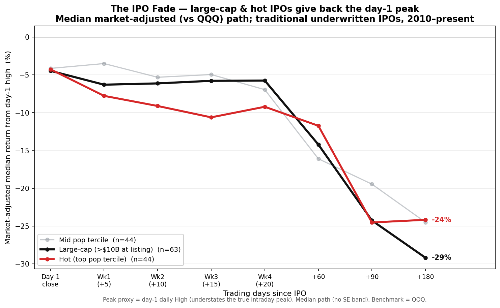
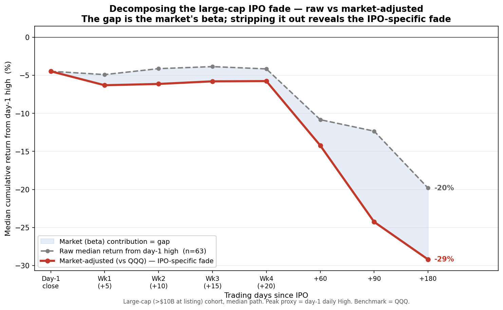
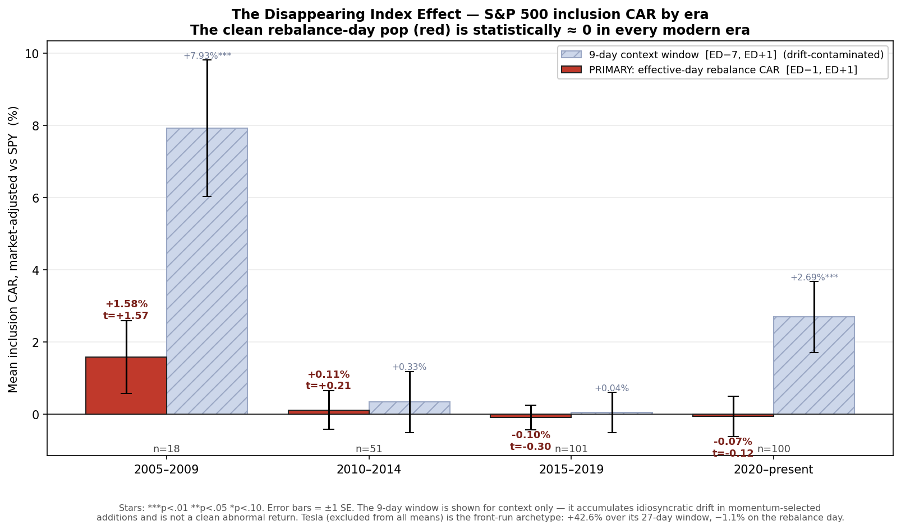
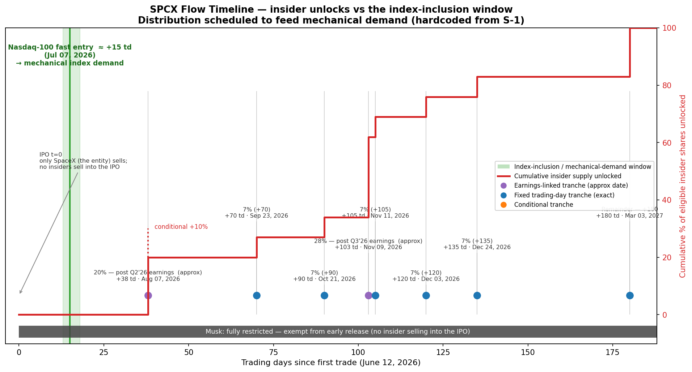

# SPCX Report — Empirical Backbone

Reproducible base-rate evidence for a public research report arguing that **SpaceX
(SPCX, Nasdaq debut ~June 12 2026) fades after its IPO**, with the index-inclusion
"pop" front-run and insiders distributing into mechanical demand.

> We do **not** analyze SPCX price data — it has not traded. That would be hindsight,
> not prediction. Instead we measure **base rates from history** (Studies 1 & 2) and a
> mechanical **flow timeline** from the S-1 (Study 3), to apply to SPCX *before* it lists.

All numbers below are produced by the scripts in `src/` from real data. Re-running
regenerates every chart, table, and statistic.

---

## TL;DR — the three numbers the report needs

| # | Question | Result |
|---|----------|--------|
| **P1** | How far do large/hot mega-cap IPOs fade from the day-1 peak, market-adjusted, by +180 trading days? | **Large-cap (>$10B) cohort: median −29.2%, mean −30.2%, t = −6.51 (p < 0.001, n = 63).** **50 of 63 large-caps faded (79%).** Closest SPCX analog (large-cap ∩ hot): median −31.7%, mean −37.3%, t = −4.71 (n = 19) — and it **stays negative (median −33.1%) after removing the top-2 positive outliers.** The fade holds across **both** volatility regimes (high-VIX −34.8%, t = −7.76; low-VIX −16.5%, t = −3.67; split over all 132 measured names). Universe is now **auto-derived** from public sources (Ritter × Nasdaq × SEC EDGAR), not a hand-picked list. |
| **P2** | Is the S&P 500 index-inclusion "pop" still there? | **No — the clean rebalance-day (effective-day) inclusion CAR is ≈ 0 in every modern era: 2020–present −0.07%, t = −0.12 (n = 100); flat across the 2010s too.** A +2.7% bump survives only in a wider 9-day window, but that is drift in momentum-selected additions, not a capturable pop. Tesla — excluded from all means as a non-length-matched 27-trading-day window — is the front-run anecdote: **+42.6% over its window vs −1.1% on the rebalance day.** ⇒ the trade is the fade, not the pop. |
| **P3** | How is SPCX insider supply scheduled relative to index demand? | Mechanical Nasdaq-100 demand ≈ **+15 td (Jul 7 2026)**; insider unlocks ramp from ≈ +38 td to **100% by +180 td (Mar 3 2027)** — distribution scheduled into the demand. |

---

## Repo layout
```
spcx-report/
  data/raw/      # cached downloads: yfinance CSVs, Ritter xlsx, Nasdaq IPO JSON,
                 # SEC EDGAR company-facts, sp500_changes.csv, universe_audit.csv
  data/clean/    # (reserved)
  data/ipo_universe.csv  # Study-1 universe — AUTO-GENERATED by build_universe.py
                 # (tickers, offer prices, computed listing valuations, exclusions)
  data/ipo_universe_curated_backup.csv  # the prior hand-curated list (archived)
  src/
    build_universe.py    # assembles the Study-1 universe from public sources
    utils.py             # cached+retried downloads, return/market-adjust/t-stat helpers
    study1_ipo_fade.py   # Study 1: the IPO fade
    study2_index_effect.py  # Study 2: the disappearing index effect
    study3_timeline.py   # Study 3: the SPCX flow timeline
  outputs/
    charts/        # ipo_fade_hero.png, ipo_fade_decomposition.png, ipo_fade.png,
                   # index_effect_by_era.png, spcx_timeline.png
    tables/        # *.csv grids + dropped_study1.csv / dropped_study2.csv (survivorship logs)
  README.md
```

## How to reproduce
```bash
pip install yfinance pandas numpy matplotlib scipy lxml openpyxl requests
cd spcx-report/src
python build_universe.py       # (re)builds data/ipo_universe.csv from public sources
                               # first run downloads Ritter/Nasdaq/EDGAR/yfinance; cached
python study1_ipo_fade.py      # ~1 min cached; longer on first run (downloads)
python study2_index_effect.py  # first run downloads ~all S&P-500 additions since 2005
python study3_timeline.py      # instant, no network
python survivorship_table.py   # by-era kept-vs-dropped survivorship summary (no network)
```
`build_universe.py` is the new first step: it derives the Study-1 ticker universe
from real IPO data (below) instead of a hand-maintained list. It is idempotent and
fully cached, so re-runs are fast and `study1_ipo_fade.py` reads its output.
Downloads are cached to `data/raw/` (one CSV per ticker), so re-runs are fast and
resumable after a rate-limit interruption. Yahoo rate-limits aggressively (HTTP 429);
`utils.fetch_history` retries with exponential backoff + jitter and logs anything it
has to drop to `outputs/tables/dropped_study1.csv` / `dropped_study2.csv`.

---

## STUDY 1 — The IPO Fade (`study1_ipo_fade.py`)

**Claim tested:** large traditional IPOs give back their day-1 peak over the following
~9 months, even after stripping out the market.



**Universe (mechanically derived, fixed before looking at outcomes).** Traditional
underwritten IPOs, 2010–present, equity value > $5B at listing. The universe is no longer
a hand-picked list — `build_universe.py` **derives it from public data** and writes
`data/ipo_universe.csv` (every keep/drop decision and per-source share estimate is logged
to `data/raw/universe_audit.csv`). The result: **153 qualifying traditional IPOs, 68
large-cap (>$10B at listing); Study 1 measures the 63 large-caps that have clean price
data** (5 dropped as delisted/acquired with no continuous Yahoo history — TWTR, Qualtrics,
HashiCorp, First Data, Altice — all logged). This is up from the prior 40-name curated
list, removing the cherry-picking concern; the prior list is archived at
`data/ipo_universe_curated_backup.csv`.

Sources and how market cap at listing is computed (no hand-entered values):
- **Master list:** Jay Ritter's UF "IPO-age" dataset — every operating-company IPO with
  offer date, ticker, ADR flag, and post-issue share count. It **excludes SPACs, spinoffs
  and closed-end funds by construction** (verified: GEHC/VLTO/GEV/SOLV, SOFI/LCID/DKNG all
  absent), so those drop for free.
- **Offer price + IPO-era ticker + exact date:** the Nasdaq IPO calendar (complete monthly
  priced-deal coverage back to 2010).
- **Shares at listing → market cap = offer × shares:** reconciled across **SEC EDGAR**
  (authoritative XBRL), **yfinance** `get_shares_full` at the IPO date, and **Ritter**
  post-issue shares — ADR-aware (EDGAR/Ritter are ordinary-share units, wrong vs a per-ADS
  offer, so ADRs use yfinance), with guards for multi-class single-class undercounts,
  yfinance/EDGAR share glitches (reject a count > 3× the recent float), and recycled
  tickers (drop a symbol whose yfinance first trade is >270 d from the IPO — e.g. ET now
  = Energy Transfer, PATH now = UiPath). Confidence is logged per name (83 high-confidence
  multi-source agreement, 41 Ritter-anchored, 27 single-source, 2 verified-fallback).
- **Direct listings** (Spotify, Slack, Palantir, Coinbase, Roblox, …) — present in Ritter
  but **excluded** by an explicit spec-mandated list (no underwriter/lockup). SPCX is a
  traditional underwritten IPO *with* a lockup, so traditional IPOs are the right comp.

**Data.** Daily OHLCV per ticker from the IPO date through +180 trading days; daily QQQ
over the same windows as benchmark. The window is anchored on the **audited IPO/offer date**
from `build_universe.py` (`utils.resolve_first_trade`), not blindly on the earliest cached
row: Yahoo sometimes prepends pre-IPO *when-issued / placeholder* rows that sit weeks-to-
months before the true first trade (ALLY 2014-01-28 vs IPO 2014-04-10; PECO 2021-02-25 vs
2021-07-15; VICI 2018-01-02 vs 2018-02-01). Those artifacts would otherwise corrupt day-1
prices, the fade window, and the split factor. Prices are split/dividend-adjusted
(`auto_adjust=True`) so multi-month return paths are internally consistent across any split.

**Formulas.** For each horizon *h* ∈ {day-1 close, +5, +10, +15, +20, +60, +90, +180}:
- raw cumulative return = `close_h / day1_high − 1`
- market-adjusted = `raw_return − (QQQ_close_h / QQQ_day1 − 1)`

**Peak proxy (stated explicitly).** The peak reference is the **day-1 daily High**. This
is a *proxy* for the true intraday peak and **understates** it (the daily High bar is the
highest print we observe; the true peak the marginal buyer paid can be no lower). Using a
conservative peak biases the measured fade toward zero, so it cannot manufacture the
result.

**Cohorts (objective, set in advance).**
- **First-day pop terciles → hot / mid / cold.** Pop = offer-to-close (preferred), using
  a cited IPO offer-price table; open-to-close fallback where an offer price is missing
  (logged). Offer-to-close is required: e.g. ABNB opened at ~$146 (offer $68) and closed
  ~$145, so *open*-to-close ≈ 0% would mislabel the hottest IPO of 2020 as "cold," while
  *offer*-to-close = +113% correctly tags it hot. The pop divides the **raw (original-
  dollar) day-1 close by the raw offer**; because Yahoo's unadjusted close is still
  *split*-adjusted, we un-apply post-IPO splits (e.g. Groupon's 1:20 reverse split would
  otherwise show a +2,500% pop; corrected it is +30.6%).
- **Large-cap cohort:** > $10B equity value at listing.
- **Robustness:** VIX-at-listing regime split (high vs low vs the sample median).

**Headline result** (median is the reported central tendency).
- Large-cap cohort by +180 td: **median −29.2%, mean −30.2%, range [≈−100%, +71%],
  t = −6.51, p < 0.001 (n = 63).** (Worst name −100.3%: market-adjusted returns can
  dip just below −100% when the benchmark rises.)
- Large-cap ∩ hot (closest SPCX analog): **median −31.7%, mean −37.3%, t = −4.71 (n = 19).**
- Hot-by-pop cohort: **median −24.2%, mean −27.1%, t = −4.80 (n = 44).**
- **Robustness #1 (outliers):** drop the top-2 positive names (BEKE, MBLY) from large∩hot
  and it **stays negative — median −33.1%, mean −43.0% (n = 17).** The SPCX analog does not
  depend on the right tail.
- **Robustness #2 (regime):** the fade holds across **both** volatility regimes — high-VIX
  −34.8% (t = −7.76, n = 66) and low-VIX −16.5% (t = −3.67, n = 66); the split is a
  median-VIX cut of all 132 measured names (>$5B), not just the 63 large-caps. It is markedly deeper
  for high-VIX listings (which SPCX resembles) but is **not** a high-volatility artifact.
  *(On the prior 40-name list low-VIX looked insignificant; the complete universe shows the
  fade is pervasive — a stronger result.)*

**Outputs:**
- `charts/ipo_fade_hero.png` — **Figure A (body/hero):** single panel, median path only,
  large-cap + hot cohorts prominent (mid faint, cold dropped), no SE bands, +180 endpoints
  labeled.
- `charts/ipo_fade_decomposition.png` — **Figure B:** large-cap cohort, raw vs
  market-adjusted median; the shaded gap is the market's (beta) contribution, the
  market-adjusted line (bold) is the IPO-specific fade.
- `charts/ipo_fade.png` — **appendix/detail backup:** full 4-cohort mean | median panels
  with ±1 SE bands.
- `tables/ipo_fade.csv` (per-ticker × horizon grid), `tables/ipo_fade_cohort_summary.csv`.

**Figure B — decomposing the large-cap fade (raw vs market-adjusted):**



### Study 1 — Robustness & universe completeness

Goal: show the large-cap fade is **not an artifact of our analysis choices**, and report
the win rate honestly. Cohort rules are unchanged. Tables: `study1_winrate.csv`,
`study1_winrate_names.csv`, `study1_robustness.csv`, `study1_universe_completeness.csv`.

**Win rate & distribution** (large-cap, +180 td, market-adjusted vs QQQ):
- **50 of 63 faded (79% negative).**
- Full distribution: min **−100.3%**, p25 **−56%**, median **−29%**, p75 **−4%**, max **+71%**.
- The **13 names that did *not* fade:** ARM +71%, VIK +55%, CRWV +42%, GFS +20%, SYF +15%,
  BEKE +14%, APP +14%, PAGP +14%, CFG +10%, MBLY +9%, AFRM +2%, U +1%, JD +0%.

**Does the fade survive every variation? Yes — it is negative and significant (t ≤ −4.3)
in all of them, and stronger than on the prior 40-name list.**

| Variant | median | mean | t | n |
|---|---|---|---|---|
| Peak = day-1 **high** (baseline) | −29.2% | −30.2% | −6.51 | 63 |
| Peak = day-1 **close** | −25.2% | −25.3% | −5.30 | 63 |
| Peak = day-1 **VWAP** | *skipped — no intraday VWAP in daily OHLCV* | | | |
| Benchmark = **QQQ** (baseline) | −29.2% | −30.2% | −6.51 | 63 |
| Benchmark = **SPY** | −30.1% | −28.8% | −5.92 | 63 |
| Benchmark = **IWM** (Russell 2000) | −24.7% | −26.9% | −5.45 | 63 |
| Horizon **+120 td** | −31.9% | −23.4% | −4.30 | 63 |
| Horizon **+180 td** (baseline) | −29.2% | −30.2% | −6.51 | 63 |
| Horizon **+250 td** | −42.1% | −36.2% | −7.16 | 62 |

**Reading it honestly:**
- **Peak proxy:** weakens but holds with the day-1 *close* (−25% vs −29%) — expected, the
  close sits below the intraday high. Still t = −5.3.
- **Benchmark:** smallest vs IWM (−25%, small-cap) and largest vs QQQ — so the fade is *not*
  an artifact of using tech-heavy QQQ; it survives a small-cap benchmark (t = −5.5).
- **Horizon:** not a cherry-picked endpoint — present at +120 and **deeper by +250 (−42%)**.
  The weakest single cell is +120 td (t = −4.30, still highly significant).
- **Universe completeness:** the universe is now derived mechanically (Ritter × Nasdaq ×
  EDGAR), so there is no separate hand-built "expanded" set — the headline universe **is**
  the complete sourced set (153 traditional IPOs >$5B; 68 large-cap; 63 with clean prices).
  The prior result on the 40-name curated list (median −31.7%, t = −4.53, n = 33)
  reproduces almost exactly on the larger universe with far higher significance.
- **In no variant does the fade vanish or flip positive; every cell is t ≤ −4.3.**

---

## STUDY 2 — The Disappearing Index Effect (`study2_index_effect.py`)

**Claim tested:** the classic S&P 500 inclusion "pop" (Shleifer 1986; Greenwood & Sammon)
has decayed toward zero, so for SPCX the trade is the *fade*, not the inclusion *pop*.



**Universe.** S&P 500 direct additions, 2005–present.

**Date sourcing (honoring the "do not invent dates" rule).** **Effective dates** are
scraped from Wikipedia's *"Selected changes to the list of S&P 500 companies"* table — a
verifiable, reproducible source, cached to `data/raw/sp500_changes.csv`. We do **not**
assert per-event announcement dates we cannot verify.

**Window discipline — the PRIMARY statistic is the effective-day (rebalance) window
`[ED−1, ED+1]`**: a clean, fixed-length, length-matched measure of the mechanical
inclusion pop. Every aggregated event uses the **same number of trading days**; any name
that cannot fill the fixed window is dropped and logged. A fixed 9-day window `[ED−7,+1]`
is reported only as **secondary context** (it brackets the ~5-day announcement lead, but
accumulates idiosyncratic drift in momentum-selected additions, so it is *not* a clean
abnormal return). **Tesla's** documented ≈5-week announcement→effective gap (announced
2020-11-16, effective 2020-12-21; the measured window spans 27 trading days) makes its
window non-length-matched, so **Tesla is excluded from every aggregate mean** and kept
only as a labeled single-name anecdote.

**Formulas.**
- market-adjusted daily return = `r_stock − r_SPY`
- event CAR = sum of market-adjusted daily returns across the (fixed-length) window
- per era: `t = mean / (sd / √n)`, two-sided p-value.

**Result (270 usable events; Tesla excluded from all means).**

| Era | Effective-day `[ED−1,+1]` — **PRIMARY** | 9-day context `[ED−7,+1]` | n |
|-----|-----------------------------------------|---------------------------|---|
| 2005–2009 | +1.58% (t=1.57) | +7.93%*** (t=4.19) | 18 |
| 2010–2014 | +0.11% (t=0.21) | +0.33% (t=0.39) | 51 |
| 2015–2019 | −0.10% (t=−0.30) | +0.04% (t=0.07) | 101 |
| 2020–present | **−0.07% (t=−0.12)** | +2.69%*** (t=2.73) | 100 |

**Headline (P2's Z).** The clean **rebalance-day inclusion CAR is statistically zero in
every modern era** — recent era **−0.07%, t = −0.12 (n = 100)**, and flat across the 2010s
too. The capturable inclusion pop is gone.

The 9-day context window shows a residual +2.69% recently, but it is pre-effective drift
in **momentum-selected additions** (the S&P adds recent winners) plus **anticipatory
front-running** — not a tradeable rebalance pop (the matched effective-day measure is
zero). **Tesla** is the front-run anecdote (excluded from all means): **+42.6% over its
27-trading-day announcement→effective window but −1.1% on the rebalance day.** This is not a
contradiction of the thesis; it *is* the thesis — predictable mechanical demand gets
front-run, leaving no pop at inclusion. **For SPCX the trade is the fade, not the pop.**

**Outputs:** `charts/index_effect_by_era.png` (effective-day window as the hero series,
9-day context muted, ±1 SE, significance stars), `tables/index_effect.csv` (per-event,
`car_eff` primary + `car_wide` context), `tables/index_effect_by_era.csv`.

---

## STUDY 3 — SPCX Flow Timeline (`study3_timeline.py`)

**Claim illustrated:** distribution is *engineered* — mechanical index demand arrives
early, and the lockup releases are scheduled to feed insider supply into that demand.



All inputs are taken **as given from the S-1** (per the spec) and plotted on a
trading-day axis from first trade (~2026-06-12). Calendar dates are computed with NYSE
holidays. **Earnings-linked tranches are approximate** (exact dates are set by SpaceX);
fixed trading-day tranches (+70/+90/+105/+120/+135/+180) are exact.

| Event | Offset | ≈ Date | Note |
|-------|--------|--------|------|
| Nasdaq-100 fast entry | +15 td | Jul 7 2026 | mechanical index demand |
| 20% unlock | ~+38 td | ~Aug 7 2026 | post Q2'26 earnings (approx) |
| +10% conditional | ~+38 td | — | if ≥30% over offer, 5 of 10 days |
| 7% × 5 | +70/+90/+105/+120/+135 | — | exact offsets |
| 28% unlock | ~+103 td | ~Nov 9 2026 | post Q3'26 earnings (approx) |
| Remainder (→100%) | +180 td | Mar 3 2027 | |
| Musk | full window | — | exempt from early release (fully restricted) |

No insiders sell into the IPO itself — only SpaceX the entity.

**Output:** `charts/spcx_timeline.png` + `tables/spcx_timeline_schedule.csv`.

---

## Survivorship by era — does dropping names bias the recent-vs-older comparison?

Both studies drop names that lack clean data (Study 1: no continuous Yahoo history through
+180 td; Study 2: cannot fill the fixed-length event window). If recent eras retained a
*larger* share of names than older eras, the apparent recent-vs-older patterns could be a
survivorship artifact. They do **not** — retention is flat-to-rising across eras in both
studies, and the **most recent era keeps the *highest* share of names**, so attrition cannot
be flattering the recent cohort. Computed by `src/survivorship_table.py` →
`outputs/tables/survivorship_by_era.csv` (regenerated from the universe + drop logs).

**Study 1 — IPO universe (traditional, >$5B at listing) by IPO era:**

| Era | IPO universe (>$5B) | Kept (measured) | Dropped (no clean data) | % kept |
|-----|---------------------|-----------------|-------------------------|--------|
| 2010–2014 | 22 | 18 | 4 | 82% |
| 2015–2019 | 35 | 30 | 5 | 86% |
| 2020–present | 96 | 84 | 12 | 88% |
| **All** | **153** | **132** | **21** | **86%** |

*Separately, names **excluded by design** (not attrition) — direct listings, $3–5B
near-misses, recycled tickers — number 20 / 26 / 69 across the three eras; each is logged
with its reason in `data/ipo_universe.csv` (`bucket = considered`) and
`data/raw/universe_audit.csv`.*

**Study 2 — S&P 500 additions by effective-date era:**

| Era | S&P 500 additions | Kept (usable window) | Dropped (window unfillable) | % kept |
|-----|-------------------|----------------------|-----------------------------|--------|
| 2005–2009 | 21 | 18 | 3 | 86% |
| 2010–2014 | 59 | 51 | 8 | 86% |
| 2015–2019 | 109 | 101 | 8 | 93% |
| 2020–present | 107 | 100 | 7 | 94% |
| **All** | **296** | **270** | **26** | **91%** |

If anything the **older** eras shed marginally more names (delistings/acquisitions accrue
with age; window-unfillable Study-2 events cluster in the thin early years), so the recent
cohorts — where both the IPO fade is strongest and the index pop is most absent — are the
**most** completely sampled, not the least. The headline comparisons are not driven by
survivorship.

## Methodology rules honored
1. **Market-adjusted everything** — QQQ (Study 1), SPY (Study 2). Raw % conflates the
   IPO's beta with the market move.
2. **n, standard errors, t-stats** reported; no conclusions from eyeballed lines.
3. **Day-1-High peak proxy stated explicitly** (and shown to bias toward zero).
4. **Every dropped/missing ticker logged** to `outputs/tables/dropped_study1.csv` /
   `dropped_study2.csv` (survivorship transparency).
5. Results framed as **incentives and mechanics**, not "manipulation."
6. This README documents cohort rules, formulas, sources, and exact reproduction steps.

## Limitations / disclosures
- **Study 1 universe (auto-derived).** `data/ipo_universe.csv` is generated by
  `build_universe.py` from Ritter (master list) × Nasdaq (offer price/date/ticker) × SEC
  EDGAR + yfinance (shares), not hand-maintained: **153 traditional IPOs >$5B at listing,
  2010+; 68 large-cap; 63 measured** (the rest delisted with no continuous Yahoo history,
  all logged). Re-run `build_universe.py` to refresh; every keep/drop decision and the
  per-source share estimates are in `data/raw/universe_audit.csv`.
- **Market cap at listing is computed, not hand-entered:** offer × shares, reconciled
  across EDGAR / yfinance / Ritter with ADR-, multi-class-, glitch- and recycled-ticker
  guards. It is approximate (sources disagree on the exact at-IPO share count for some
  multi-class and ADR names) and is used **only** for the $5B/$10B size thresholds; the
  headline fade does not depend on valuation precision. Confidence per name is logged
  (83 high / 41 Ritter-anchored / 27 single-source / 2 verified-fallback).
- **First-day pop is split-corrected, anchored on the audited IPO date.** The pop uses the
  raw original-dollar day-1 close; since Yahoo's unadjusted close can still be split-adjusted,
  normal post-IPO splits are un-applied via `utils.split_factor_since` (Groupon's reverse
  split would otherwise read +2,500%; corrected +30.6%). The whole window is anchored on the
  audited IPO date (`utils.resolve_first_trade`), so pre-IPO when-issued/placeholder rows are
  excluded — which also fixes **ALLY's phantom 310.0 "split"**: that event is dated exactly on
  the IPO day (2014-04-10), so once the window starts there it is excluded by `split_factor_since`
  (strict `>`) and ALLY's factor is 1.0 (offer-to-close pop −4.1%, was a spurious +32,100%
  under the wrong 2014-01-28 anchor). A `pop_split_note` defense-in-depth guard remains in
  `ipo_fade.csv` for any future name that exposes a plausible-when-ignored / absurd-when-applied
  factor. A full-sample audit confirmed ALLY is the only phantom factor; the other 7 split
  factors (GRPN, LOGC, ROOT, GOCO, LU, PAGP, HLT) are legitimate reverse-splits/spinoffs and
  correct properly.
- **IPO offer prices** (Study 1) come from the Nasdaq IPO calendar (priced deals), used
  for the first-day-pop cohort split and, with shares, the size filters. The pop-tercile
  split and the headline fade do not depend on valuation precision.
- **Study 2 window / Tesla.** The PRIMARY statistic is the length-matched effective-day
  window; the 9-day window is context only (drift-contaminated). Announcement dates are
  not hardcoded. Tesla (non-length-matched 27-trading-day window) is excluded from all means and
  reported only as an anecdote. Every event uses the same number of trading days or is
  dropped + logged.
- **Study 3 earnings dates** are approximate; the fixed trading-day tranches are exact.
- yfinance/Yahoo data and Wikipedia tables can change; all pulls are cached so a given
  run is reproducible from `data/raw/`.
- **No SPCX data / no back-test.** SPCX has not traded; we never pull or analyze SPCX
  prices. These are historical base rates committed *before* the June 12 2026 debut —
  predictions, not hindsight.

## Data sources
- **IPO master list (Study-1 universe):** Jay Ritter, University of Florida "IPO-age"
  dataset (`site.warrington.ufl.edu/ritter/files/IPO-age.xlsx`) — the academic standard,
  now consumed programmatically by `build_universe.py`.
- **IPO offer price / IPO-era ticker / priced date:** Nasdaq IPO calendar
  (`api.nasdaq.com/api/ipo/calendar`).
- **Shares outstanding at listing:** SEC EDGAR XBRL company facts
  (`data.sec.gov/api/xbrl/companyfacts/...`) + yfinance `get_shares_full` + Ritter
  post-issue shares (reconciled).
- **Prices:** Yahoo Finance via `yfinance` (split/dividend-adjusted daily OHLCV).
- **S&P 500 changes:** Wikipedia *List of S&P 500 companies* (Selected changes table).
- **SPCX lockup / index structure:** the S-1 (as transcribed in the spec).
